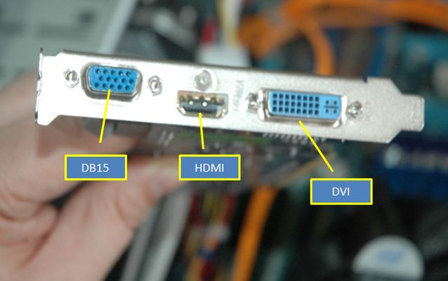

# tarea 
### conectores externos 
 

*Un puerto **DVI** (Interfaz Visual Digital) es un tipo de conector de vídeo para transmitir señales de video digital desde una computadora a un monitor o pantalla. Fue diseñado para reemplazar al conector analógico VGA y ofrece mejor calidad de imagen. Los puertos DVI admiten tanto señales digitales como analógicas (en sus versiones DVI-I), y las versiones de doble enlace pueden ofrecer mayor resolución y calidad de imagen que las de enlace único

